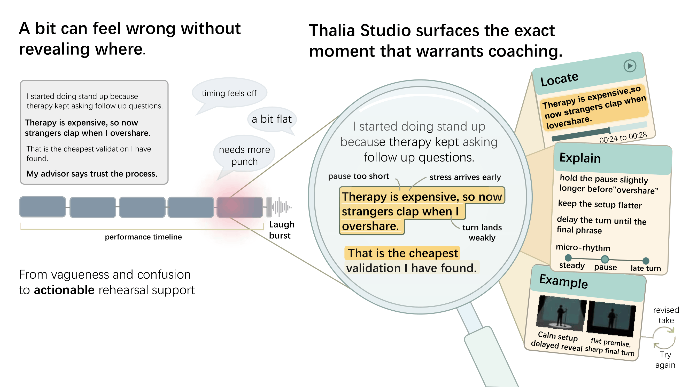
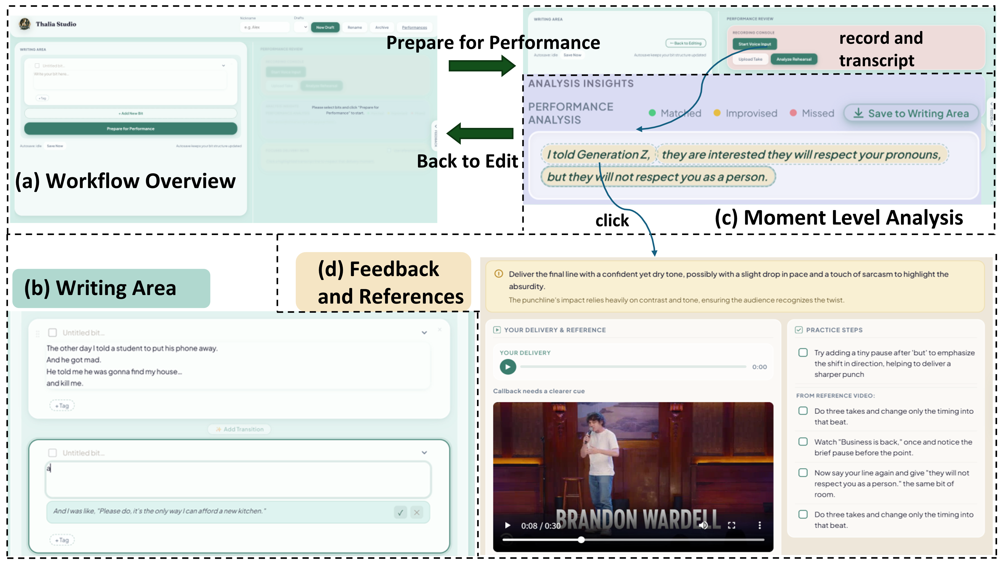
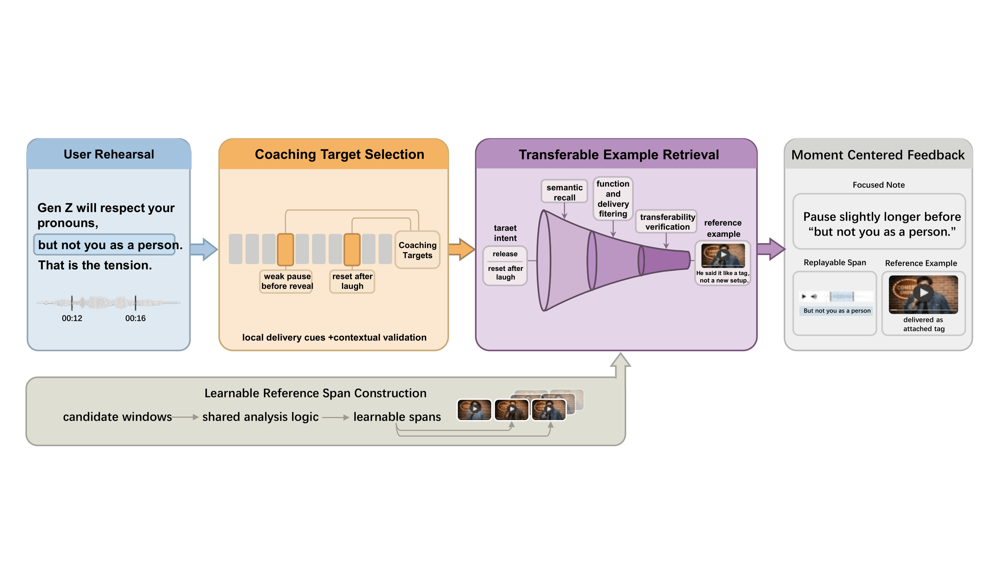

# Thalia Studio

## Overview

<p align="center">
  
</p>

Thalia Studio is a rehearsal support system for stand-up comedy. It is designed to support an iterative workflow in which performers draft a bit, record a take, inspect moment-level feedback, revise the material, and try again.

Starting from a recorded rehearsal, the system highlights locally consequential moments in delivery, provides focused feedback grounded in the user’s own performance, and, when a prepared reference dataset is available, retrieves short video examples whose performance logic may help guide revision.

This repository contains the research prototype associated with our work on AI-supported stand-up comedy rehearsal. The project brings together writing support, rehearsal recording, performance analysis, and example-grounded revision within a single workflow.

## Interface and Workflow

<p align="center">
  
</p>

Thalia Studio supports an iterative rehearsal loop:

1. **Prepare for performance.** Users draft and organize material in the Writing Area.
2. **Record and analyze.** Users record a take and inspect a color-coded transcript that highlights matched, improvised, and missed material.
3. **Inspect moment-level feedback.** Users click a highlighted moment to view a focused delivery note, replay a local span, and study a retrieved reference example when available.
4. **Revise and try again.** Users return to the writing area to revise wording, order, or emphasis and rehearse again.

## Technical Pipeline

<p align="center">
  
</p>

The system is organized around three core components:

1. **Coaching target selection.** A recorded take is transcribed and segmented into short replayable spans. The system identifies moments whose local delivery may affect how the surrounding material is heard.
2. **Learnable reference span construction.** Long stand-up videos are converted into shorter reference spans that can function as teachable examples.
3. **Transferable example retrieval.** For each coaching target, the system retrieves a reference example whose performance logic is useful for revision.

## What This Repository Includes

This repository contains the research prototype, including:

- the web interface for writing and rehearsal
- the recording and transcript-based analysis flow
- the focused feedback and reference presentation logic
- the dataset preparation and indexing scripts used to support retrieval

## Important Note on Video Data

> **Important**
> Retrieved video references depend on a locally prepared reference dataset.
> The stand-up video corpus is **not distributed** with this repository.
> To enable retrieval, you must obtain the source videos yourself and run the preprocessing and indexing pipeline in advance.

This repository does not ship the stand-up video corpus used for retrieved references. The retrieval component depends on a prebuilt local reference database rather than raw videos alone. In practice, this means that retrieval will only work after the source videos have been prepared, processed into reference spans, and indexed locally.

If you skip dataset preparation, the writing and rehearsal parts of the application may still run depending on your local setup, but video-based reference retrieval will not be available.

## Preparing the Reference Dataset

To enable retrieved video examples, you must prepare the reference dataset yourself:

1. Obtain the source stand-up videos on your own.
2. Place the videos in the expected local data directory.
3. Run the preprocessing and indexing pipeline before launching retrieval-dependent features.

## Requirements

- Python 3.11+
- `ffmpeg` and `ffprobe` recommended for audio and preview generation
- OpenAI API credentials for model-backed analysis, ASR, and TTS
- Pinecone credentials if you want vector-backed reference retrieval
- A local database via `DATABASE_URL` or `MYSQL_URL`
  - SQLite is the simplest option for basic local use
  - The code still accepts `MYSQL_URL` as a legacy fallback name

## Quick start

### 1. Create and activate a virtual environment

On macOS / Linux:

```bash
python -m venv .venv
source .venv/bin/activate
```

On PowerShell:

```powershell
python -m venv .venv
.\.venv\Scripts\Activate.ps1
```

### 2. Install dependencies

```bash
pip install -r requirements.txt
```

### 3. Create a local environment file

```bash
python scripts/create_local_env.py
```

This creates `.env` from `.env.example`.

### 4. Edit `.env`

At minimum, fill in the variables you need for your setup.

For a basic local run, the most important ones are:

```env
OPENAI_API_KEY=
DATABASE_URL=sqlite:///artifacts/dev.db
DISABLE_VIDEO_DATASET_INGEST=1
```

If you leave dataset ingest disabled, the app can still run without a local video corpus.

### 5. Initialize the database

```bash
python scripts/init_db.py
```

### 6. Start the app

```bash
python run.py
```

Then open:

```text
http://127.0.0.1:5000
```

## Running without the video dataset

This is the easiest way to try the project.

Use the following setup:

```env
DATABASE_URL=sqlite:///artifacts/dev.db
DISABLE_VIDEO_DATASET_INGEST=1
```

With this configuration:

- The app can boot locally
- Writing and rehearsal analysis can still run
- Reference-video retrieval will not be available unless a dataset has already been indexed

## Enabling reference-video retrieval

Reference retrieval requires **more than just starting the app**. You need to prepare the video data first.

### Step 1. Obtain a local stand-up video corpus

This repository does **not** ship with the video files.
You must provide your own local dataset and place it under the directory specified by:

```env
VIDEO_DATASET_ROOT=movies
```

You may change that path to any local directory containing your video files.

### Step 2. Configure the required environment variables

A typical setup for dataset-backed retrieval looks like this:

```env
OPENAI_API_KEY=your_key_here
PINECONE_API_KEY=your_key_here
DATABASE_URL=sqlite:///artifacts/dev.db
VIDEO_DATASET_ROOT=movies
DISABLE_VIDEO_DATASET_INGEST=0
```

Depending on your setup, you may also want to configure:

```env
VIDEO_DATASET_CACHE_DIR=artifacts/video_dataset/cache
VIDEO_DATASET_PREVIEW_DIR=app/static/rehearsal/video_preview
VIDEO_DATASET_CHUNK_LEN_SEC=30.0
VIDEO_DATASET_OVERLAP_SEC=5.0
VIDEO_DATASET_TOP_K=3
VIDEO_DATASET_INITIAL_TOP_K=20
```

### Step 3. Preprocess and index the dataset

Before retrieval can work, the dataset must be scanned, chunked, annotated, and indexed.

Run:

```bash
python scripts/reindex_dataset_references.py
```

This step builds the dataset references used by the retrieval pipeline. Depending on dataset size and your environment, it may take a while.

In practical terms, this means:

- The app does **not** come with ready-to-use reference clips
- Users must prepare the video data themselves
- Users must run the preprocessing / indexing step **before** expecting retrieval to work

### Step 4. Start the app

After indexing completes successfully:

```bash
python run.py
```

## Key environment variables

Main variables used by the project include:

- `OPENAI_API_KEY`
- `OPENAI_TTS_MODEL`
- `OPENAI_ASR_MODEL`
- `PINECONE_API_KEY`
- `DATABASE_URL`
- `MYSQL_URL` as a legacy fallback
- `VIDEO_DATASET_ROOT`
- `VIDEO_DATASET_CACHE_DIR`
- `VIDEO_DATASET_PREVIEW_DIR`
- `DISABLE_VIDEO_DATASET_INGEST`
- `AUTO_VIDEO_DATASET_INGEST`
- `DISABLE_REFERENCE_LLM_ENRICHMENT`

See `.env.example` for the full list.

## Running tests

```bash
python -m pytest -q
```

A lightweight test setup is:

On macOS / Linux:

```bash
export DATABASE_URL='sqlite:///:memory:'
export DISABLE_VIDEO_DATASET_INGEST='1'
python -m pytest -q
```

On PowerShell:

```powershell
$env:DATABASE_URL='sqlite:///:memory:'
$env:DISABLE_VIDEO_DATASET_INGEST='1'
python -m pytest -q
```

## Notes on scope

This repository is best understood as a **research prototype**, not a polished production release.
Some features depend on external services, local media tools, and a preprocessed video corpus. Reproducing the full reference-retrieval experience therefore requires more setup than simply cloning the repository and running `python run.py`.

## License

This repository is released under the MIT License.
